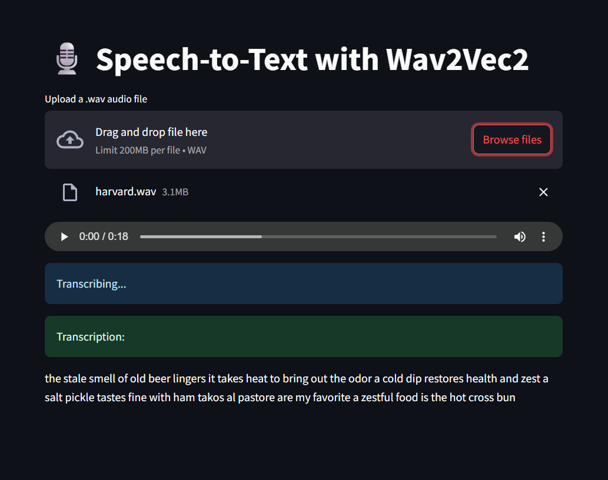

# 🎙️ Streamlit Speech-to-Text App using Facebook Wav2Vec2

This is a simple Streamlit web application that converts `.wav` audio files into text using the **Wav2Vec2** model from Facebook AI and HuggingFace Transformers.

## 1. Features

- Upload `.wav` files and transcribe speech to text.
- Uses `facebook/wav2vec2-base-960h` pretrained model.
- Real-time inference using PyTorch and Streamlit.
- Handles mono and stereo audio.
- Automatically resamples audio to 16kHz.

## 2. Run the app:

   ```bash
   streamlit run app.py
  ```
# Output Sample


